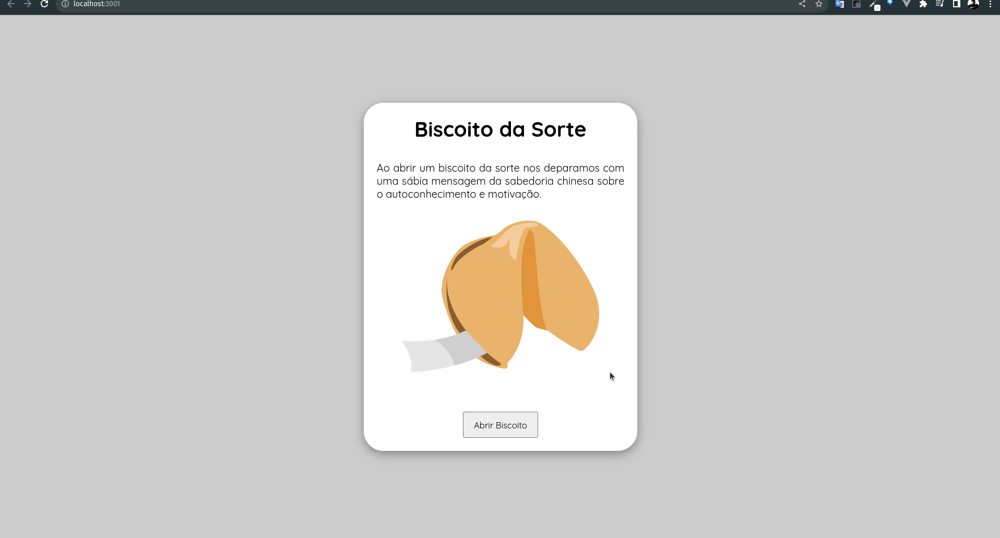

 

<h1> Biscoito da Sorte </h1>
  
 

 
 

  <a href="#clipboard-sobre-o-projeto">Sobre o Projeto</a>&nbsp;&nbsp;&nbsp;|&nbsp;&nbsp;&nbsp;
  <a href="#computer-tecnologias-utilizadas">Tecnologias</a>

  

## :clipboard: Sobre o Projeto
Este projeto foi criado com Create React. Ao clicar em abrir um biscoito, vai ser mostrada uma sábia mensagem da sabedoria chinesa sobre o autoconhecimento e motivação.

### :warning: Como iniciar esse projeto.
#### 1 - Clonar o projeto (baixar para sua maquina) Via HTTPS ou SSH

 HTTPS `git clone https://github.com/mqsoares/BiscoitoDaSorte-React.git`
  
 SSH `git clone git@github.com:mqsoares/BiscoitoDaSorte-React.git`

#### 2 - Dentro da pasta do projeto rodar o comando no terminal
 `npm start`
 
 Abra [http://localhost:3000](http://localhost:3000) para visualizá -lo no seu navegador.

## :computer: Tecnologias utilizadas

- HTML
- CSS
- JavaScript
- React 
